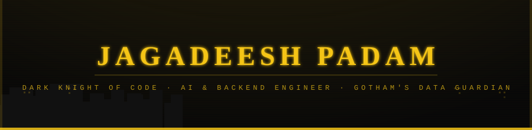

<div align="center">



[](https://git.io/typing-svg)

<p>
  <a href="https://linkedin.com/in/jagadeeshpadam"></a>
  <a href="mailto:jagadeeshpadam2003@gmail.com"></a>
  <a href="https://www.leetcode.com/bashman786"></a>
  <a href="https://jagadeeshpadam.github.io/Portfolio/"></a>
</p>

> *"It's not who I am underneath — but what I build that defines me."*

</div>

---

## 🦇 The Dark Knight

```python
class DarkKnightOfCode:
    def __init__(self):
        self.alias        = "Jagadeesh Padam"
        self.role         = "Junior Software Engineer @ Selkea AI (Promoted from Intern)"
        self.location     = "Bangalore, India 🌆 — Gotham's Tech District"
        self.education    = "B.Tech CSE — SRKR Engineering College (CGPA: 9.31/10)"
        self.mission      = "Protect enterprise systems from data chaos, privacy breaches & brittle architecture"
        self.weapons      = ["RAG Pipelines", "LangGraph", "LLM Integration", "Semantic Search"]
        self.languages    = ["Python", "SQL"]
        self.currently    = "Building production AI systems for regulatory intelligence at Selkea AI"
        self.ask_me_about = ["FastAPI", "LangGraph", "Vector DBs", "AWS", "System Design"]

    def philosophy(self):
        return "The strength of Batman is not his gadgets — it's his discipline. 🦇"

    def current_mission(self):
        return "10,000+ regulatory documents indexed. Gotham's compliance teams protected. 📡"
```

---

## ⚡ The Utility Belt — Tech Stack

<div align="center">

**🦇 Detective Arsenal — Languages & Backend**


**🤖 Bat-Computer — AI / ML / Retrieval**


**🏰 Gotham's Data Vaults — Databases & Infra**


**🔧 Bat-Tools**


</div>

---

## 💼 Field Operations — Experience

<table>
  <tr>
    <td><b>🦇 Gotham HQ</b></td>
    <td><b>⚔️ Mission Role</b></td>
    <td><b>📅 Active Since</b></td>
  </tr>
  <tr>
    <td><b>Selkea AI</b></td>
    <td>Junior Software Engineer <i>(Promoted from SDE Intern, Apr 2025)</i></td>
    <td>Dec 2024 – Present · Bangalore</td>
  </tr>
</table>

> *"In a city drowning in regulatory chaos, someone had to build the systems to bring order."*

> 🦇 **The Bat-Intelligence Network** — Production RAG pipeline over **10,000+ regulatory documents** from RBI, SEBI, NPCI, IRDAI. Semantic search. Grounded answers. Zero misses.
>
> 🕷️ **The Bat-Computer Orchestration** — Multi-stage retrieval with **LangGraph** agents: multi-query expansion, contextual filtering, precision document ranking.
>
> 📡 **The Bat-Signal Surveillance System** — Automated scrapers tracking RBI & SEBI regulatory updates in real time. The Dark Knight doesn't react — he anticipates.
>
> 🗄️ **The Batcave Document Vault** — Unified ingestion pipeline via **Azure Document Intelligence** → embeddings → **Qdrant** + **Elasticsearch**. Every document indexed. Every query answered.
>
> ☁️ **Bat-Cave Cloud Infrastructure** — Deployed **AWS EC2, DocumentDB, S3** ensuring high availability. Gotham's systems cannot go dark.
>
> 👁️ **Bat-Surveillance** — **Sentry** observability: real-time error tracking, performance insights, faster incident response. Batman's eyes on every corner of production.

---

## 🚀 Gotham's Most Wanted — Projects

<div align="center">

<a href="https://github.com/JagadeeshPadam/SecureLLM">
  
</a>
&nbsp;&nbsp;&nbsp;
<a href="https://github.com/JagadeeshPadam/PGFusion">
  
</a>

</div>

---

### 🔐 SecureLLM (RedacGPT) — The Privacy Cowl

> `Python` `FastAPI` `Next.js 14` `Redis` `PostgreSQL` `Presidio` `Google Gemini` `SSE`

*"The enemy isn't out there. Sometimes it's in the data you send."*

Batman doesn't let sensitive intelligence fall into the wrong hands. **Neither does SecureLLM.**

| Stat | Result |
|------|--------|
| 🦇 PII Types Neutralized | **18+ entity types** |
| ⚡ Detection Accuracy | **98%+** via Presidio |
| 🔐 Context Assembly | **Sub-millisecond** (Redis hot cache) |
| 🏛️ Cold Storage | **AES-128-CBC Fernet encrypted** PostgreSQL vault |

- **Privacy-first AI proxy** intercepting and anonymizing PII before it ever reaches an LLM — 98%+ detection accuracy, enterprise-grade compliance
- **Dual-tier memory vault**: Redis (sub-ms hot cache) + PostgreSQL (AES-128-CBC Fernet encrypted) — the Batcave has two vaults, both impenetrable
- **SSE streaming** with Google Gemini for real-time token delivery, maintaining semantic integrity via numbered entity placeholders across multi-turn sessions
- **SOLID + Dependency Injection** for seamless LLM swaps (Gemini/OpenAI/Ollama) — modular as a Bat-suit upgrade. Zero architectural regression

---

### 🏰 PGFusion — The Unified Batcave Data Fortress

> `Python` `PostgreSQL` `pgvector` `FastAPI` `Asyncio` `asyncpg`

*"Why maintain three Batcaves when one fortress can rule them all?"*

| Stat | Result |
|------|--------|
| 🏰 Infra Complexity Reduced | **60%** fewer network hops |
| ⚡ Vector Retrieval | **Sub-100ms** similarity search |
| 🗄️ Databases Replaced | MongoDB + Redis + Pinecone/Milvus |
| 🔒 Compliance | **Full ACID** maintained |

- **Unified multi-model data layer** in PostgreSQL — replacing MongoDB, Redis, AND dedicated Vector DBs simultaneously. One fortress. Three roles. Zero compromise.
- **Vector Search engine** via `pgvector` + IVFFlat indexing — sub-100ms similarity retrieval across high-dimensional embeddings. The Bat-Computer answers before you finish asking.
- **JSONB + GIN indexing** for schemaless CRUD matching native document stores — with ACID compliance intact
- **Async TTL-based caching** using relational tables + `asyncpg` — background cleanup runs silently, like Batman in the shadows

---

## 📊 Bat-Computer Stats

<div align="center">


</div>

<div align="center">

[](https://git.io/streak-stats)

</div>

---

## 🏆 Honors of the Dark Knight

| 🦇 | Achievement |
|----|-------------|
| ⚔️ | **300+ algorithmic problems** conquered on LeetCode & HackerRank — the Bat-Computer runs every night |
| 🥈 | **Silver Medal — 2nd Rank** in first-year academics · CGPA 9.69/10 — even Bruce Wayne topped his class |
| 🇮🇳 | **National Finalist — Smart India Hackathon 2024** · Telemedicine Kiosk · Batman solves real problems |
| 🥇 | **1st Place — SRKR Code-Knight** competitive programming contest · The knight competes. The knight wins. |
| 🏅 | **3rd Place — VIT-B Code-Chaser** programming contest |
| 👨‍🏫 | **Competitive Coding Lead** — SRKR Coding Club · Organized *HackOverflow* (national-level) · Mentored 50+ future knights |

---

## 📈 Gotham Night Watch — Contribution Activity

<div align="center">

[](https://github.com/JagadeeshPadam)

</div>

---

<div align="center">

```
  /\   /\
 /  \ /  \
/ 🦇  🦇  \
\          /
 \        /
  \______/

  I AM VENGEANCE.
  I AM THE NIGHT.
  I AM THE ENGINEER.
```

*"I wear the cowl not because I want to — because I have to."*

</div>
